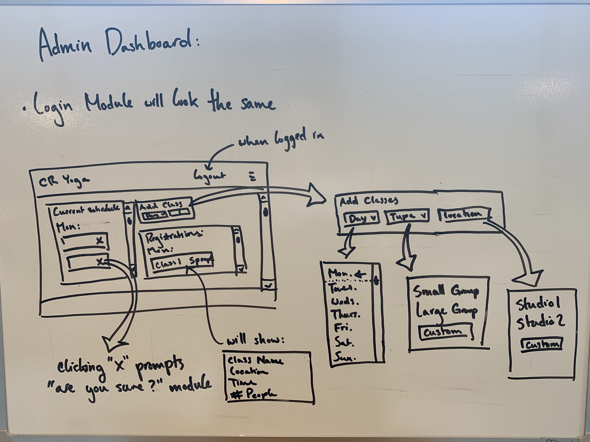

# yoga

### Name:

Charlotte Resnick Yoga

### MVP:

- Home page
- About page
- Contact page
- Take A Class page
- User Profile Page
- Admin Dashboard pages
- User registration/login with Google Auth
  Admin dashboard:
- Instructor side; I can set classes for a given day/week for student viewing
- Student side; view daily/weekly classes, manage their class sign-ups
- Protected routes; only the admin can add classes for student viewing

### Reach Goals:

- Payment processing on payments page or on registration for class (reroute to payment popup)

### User stories:

- A new user can read about me and my yoga practice, create an account and view class times for either small or large group classes
  - Users can manage their class sign-ups on their profile page; can cancel classes
- Users can contact me to schedule 1:1 session with pre-formatted email (subject line completed)
- Users can view a list of class times and register; when a user clicks on a class to register, they will be redirected to a either a payment module or new page then rerouted back to either the calendar or home page (REACH GOAL)
- I can manage my availability and update class schedules

### Wireframes:

### Database Diagrams:

### Technologies:

- Back-end: Express
- Front-end: React, Chakra UI
- Google Auth
- Will be using an ORM
- REACH TECH: Twilio for text class and cancellation reminders, SendGrid for auto-generated emails

### Timeline:

- Friday 9/18: Back-end pt.1 & tests
- Saturday 9/19: Back-end pt.2 & tests
- Sunday 9/20: Back-end pt.3 & tests
- Monday 9/21: Back-end pt.4 & tests
- Tuesday 9/22: Front-end pt.1 - Auth & context
- Wednesday 9/23: Front-end pt.2 - Styling Bonanza!
- Thursday 9/24: Front-end pt.2 - Styling Bonanza Pt.2
- Friday 9/25: Buffer Day 1 - Start on payment processing/reach tech? Deploy to Heroku & personal site
- Saturday 9/26: Buffer Day 2 - Continue on payment processing, implement other reach tech
- Sunday 9/27: Wrap up; put finishing touches on project

### Potential Challenges & Obstacles:

- Admin versus User side - protecting these routes may be tricky
- Payment processing is a HUGE reach

### Repo Link:

https://github.com/charlotteresnick/yoga
