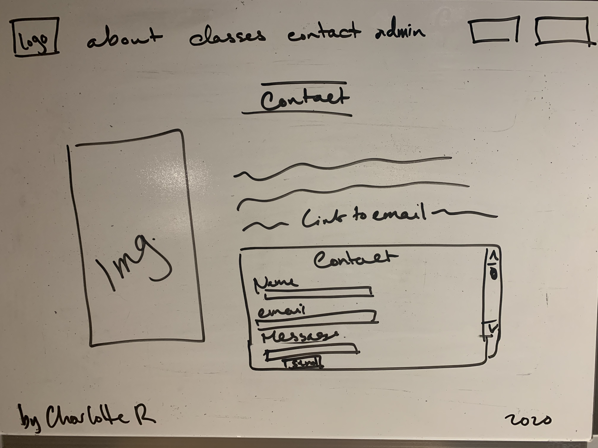

# Yoga

### Name:

Charlotte Resnick Yoga

### Link To App Repo:

https://github.com/charlotteresnick/charlotte-resnick-yoga

### Link To Deployed App on Heroku:

https://stormy-refuge-76065.herokuapp.com/

## Final Screenshots:

#### User Side:

#### Admin Dashboard:

### Technologies (Updated):

- Back-end:
  - Express
    - I decided to use JWT authentication instead of session auth because I was interested in learning a new technology
- Front-end:
  - React
    - I used React Table and used both Chakra Ui and Material UI for styling
  - Chakra UI
    - I needed a feature that was not available with Chakra UIs current release version, so I learned and implemented their 1.0 Beta
  - Material UI
    - I needed to display a tremendous amount of data and needed the ability to make edits. After some searching, I found Material UI and combined components from it with Chakra to create the functionality that I wanted
  - Knex
    - Integrates well with Objectionjs (the ORM I used, which unfortunately doesn't have a built in query builder)
  - Objectionjs
    - The ORM I decided to implement, allowed me to set up my relations in a way similar to Rails (which I liked a lot). Objection allowed me to write in the way I wanted to without having to context switch between Rails and JavaScript

### General Approach:

When beginning my project, I put plenty of time into planning what I wanted my UI to look like, designing my database structure, and researching different technologies to implement in order to achieve almost exactly what I wanted. I thought about what I had enjoyed building throughout the course and the languages I enjoyed building in, which influenced some of the decisions I made as far as technologies are concerned (using Objectionjs in tandem with Knex and several different UI libraries).

While I was building, I segmented my files into a client and a server side for organization and because there were specific dependencies that I wanted to be installed on each side. I worked through each of the different pages on the user and the admin sides of the application and built with modularity in mind as to avoid redundancies in my codebase and potential bugs down the road.

### Installation Instructions:

- from the route directory:
  - cd server; yarn install; cd ..
  - cd client; yarn install; yarn start
- set up postgres database:
  - createdb [database name]

### User stories (Updated):

- Users are students of mine looking to manage their class schedule, inquire about private yoga classes and stay in contact with me
- Additionally, admin are able to update class schedules, view and manage students as well as messages from a streamlined and well organized Admin dashboard

### Wireframes:

#### User Side:

#### Admin Dashboard:

### Unsolved Problems & Hurdles:

- I decided to implement JWT auth, which took longer than anticipated when it came to debugging
- Timestamp conversion was trickier than expected, as well
- I wasn't able to tackle enabling students to add classes from the master schedule to their schedules. Additionally, I was not able to implement payment processing
- React tables and creating my own tables was also a major hurdle. That said, I'm very pleased with the results

### MVP (Updated):

- Home page
- About page
- Contact page
  - With messaging form
- Pricing page
- Class Schedule page
  - Ability to add classes from master schedule to personal schedule
- Admin Dashboard pages (3 distinct pages)
  - View, manage, and edit student information
  - Edit and post new classes to schedule
  - View and manage record of messages from students
- Registration/Login pages

### Reach Goals:

- Payment processing on payments page or on registration for class (reroute to payment popup)

#### User stories (From Project Proposal):

- A new user can read about me and my yoga practice, create an account and view class times for either small or large group classes
- Users can manage their class sign-ups on their profile page; can cancel classes
- Users can contact me to schedule 1:1 session with pre-formatted email (subject line completed)
- Users can view a list of class times and register; when a user clicks on a class to register, they will be redirected to a either a payment module or new page then rerouted back to either the calendar or home page (REACH GOAL)
- I can manage my availability and update class schedules

### Database Diagrams:

### Proposed Timeline (From Project Proposal):

- Friday 9/18: Back-end pt.1 & tests
- Saturday 9/19: Back-end pt.2 & tests
- Sunday 9/20: Back-end pt.3 & tests
- Monday 9/21: Back-end pt.4 & tests
- Tuesday 9/22: Front-end pt.1 - Auth & context
- Wednesday 9/23: Front-end pt.2 - Styling Bonanza!
- Thursday 9/24: Front-end pt.2 - Styling Bonanza Pt.2
- Friday 9/25: Buffer Day 1 - Start on payment processing/reach tech? Deploy to Heroku & personal site
- Saturday 9/26: Buffer Day 2 - Continue on payment processing, implement other reach tech
- Sunday 9/27: Wrap up; put finishing touches on project

### Potential Challenges & Obstacles (From Project Proposal):

- Admin versus User side
- Payment processing is a HUGE reach
